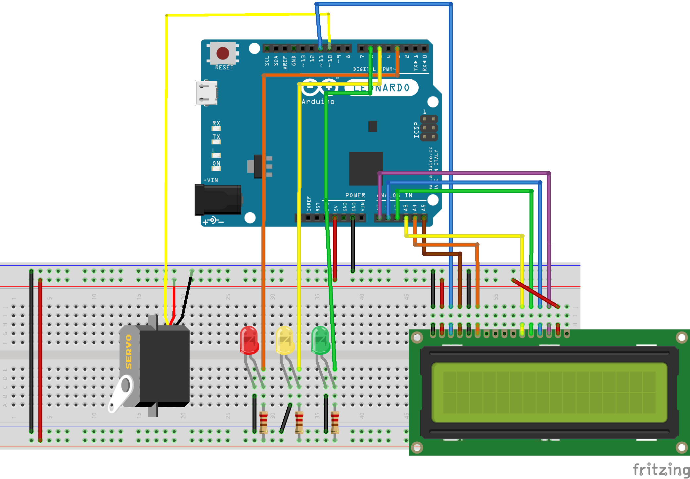

# Arduino Web USB Example

An example project that shows how to send commands from a web application to an Arduino board connected through USB.

https://mcattarinussi.github.io/arduino-web-usb-example

## Arduino Setup

### Components

- 1 x Arduino board: must be one of the supported boards listed [here](https://github.com/webusb/arduino#compatible-hardware).
- 1 x 830-Point breadboard
- 19 x Breadboard jumper wires M-M
- 1 x LCD Screen 16x2 (compatible with Hitachi HD44780 driver)
- 1 x LED 5mm red
- 1 x LED 5mm yellow
- 1 x LED 5mm green
- 3 x 220Ω resistor
- 1 x Tower Pro Micro Servo SG90

### Circuit

### Software

- Install WebUSB library: instructions [here](https://github.com/webusb/arduino#getting-started)
- Connect your Arduino board and load the sketch [main.ino](./arduino/main/main.ino)
- Open the [webapp](https://mcattarinussi.github.io/arduino-web-usb-example) and click on `Connect Device`. The first time you need to manually pair your Arduino board. Once paired, from next time the board will be automatically detected.

## Scripts

All the scripts must be run from the [webapp folder](./webapp).

### Run locally

    yarn start

### Deploy

    yarn deploy
